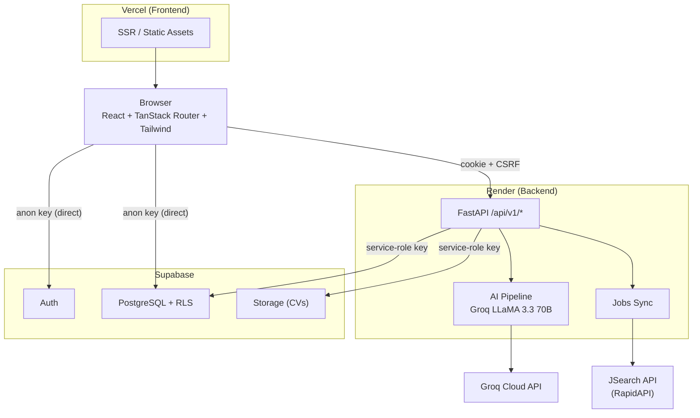

# LockeIn

A full-stack career platform for UK students and graduates. Upload your CV, get AI-driven feedback on job fit, generate tailored cover letters, and browse live job listings across four industries — all from one interface.

**Live:** [locke-in.vercel.app](https://locke-in.vercel.app) · **Backend:** Hosted on [Render](https://render.com)

---

## Tech Stack

| Layer | Technology |
|-------|------------|
| Frontend | React 19, TypeScript, TanStack Start (SSR), Vite, Tailwind CSS, shadcn/ui |
| Backend | Python 3.12, FastAPI, Pydantic, httpx |
| AI | Groq Cloud API (LLaMA 3.3 70B), sentence-transformers (semantic similarity) |
| Database | Supabase (PostgreSQL + Auth + Storage), Row Level Security on every table |
| Jobs API | JSearch via RapidAPI |
| Deployment | Vercel (frontend), Render (backend) |

---

## Architecture



---

## Features

- **Job browsing** — Live listings across Technology, Finance, Law, and Engineering/Science, sourced from JSearch API with server-side normalisation and deduplication.
- **CV analysis** — Upload a PDF CV and get AI-powered fit scoring, gap analysis, and edit suggestions against any job listing.
- **Cover letter generation** — One-click cover letters tailored to a specific job, with adjustable tone via a voice profile (directness, formality, confidence, warmth, energy, detail).
- **Secure auth** — Supabase Auth (email/password + Google OAuth) with httpOnly cookie sessions, CSRF double-submit protection, and IP-based rate limiting.
- **Defence-in-depth security** — Dual-layer input sanitisation (frontend + backend), CSP headers, Row Level Security on every database table and storage bucket.

---

## Project Structure

```
LockeIn/
├── src/                          # React frontend
│   ├── routes/                   # File-based routing (TanStack Router)
│   ├── components/               # UI components (shadcn/ui + custom)
│   ├── lib/                      # Auth, API clients, sanitisation, utils
│   └── integrations/supabase/    # Supabase client setup + types
├── backend-fastapi/              # Python API server
│   ├── app/api/routes/           # auth, ai, jobs, health endpoints
│   ├── app/services/             # AI pipeline, PDF extraction, rate limiter
│   ├── app/core/                 # Config, sanitisation
│   ├── app/models/               # Pydantic request/response schemas
│   └── tests/                    # pytest unit tests (sanitisation, rate limiter)
├── supabase/migrations/          # SQL migrations (schema + RLS policies)
├── tests/smoke/                  # Playwright end-to-end tests
└── docs/                         # API contract, testing guides
```

---

## Local Development

### Prerequisites

- Node.js 18+
- Python 3.12+
- A [Supabase](https://supabase.com) project (free tier works)
- A [Groq](https://console.groq.com) API key (free tier works)
- A [RapidAPI](https://rapidapi.com) key with JSearch subscription (optional — for job sync)

### Frontend

```bash
cp .env.example .env            # fill in Supabase + API values
npm install
npm run dev                     # → http://localhost:5173
```

### Backend

```bash
cd backend-fastapi
cp .env.example .env            # fill in all required keys
pip install -r requirements.txt
uvicorn app.main:app --reload   # → http://localhost:8000
```

The Vite dev server proxies `/api/v1` requests to the backend at port 8000 automatically.

---

## Environment Variables

### Frontend (`.env`)

| Variable | Purpose |
|----------|---------|
| `VITE_SUPABASE_URL` | Supabase project URL |
| `VITE_SUPABASE_PUBLISHABLE_KEY` | Supabase anon/public key |
| `VITE_SUPABASE_PROJECT_ID` | Supabase project ID |
| `VITE_API_BASE_URL` | Backend URL (production only — dev uses Vite proxy) |

### Backend (`backend-fastapi/.env`)

| Variable | Purpose |
|----------|---------|
| `SUPABASE_URL` | Supabase project URL |
| `SUPABASE_PUBLISHABLE_KEY` | Supabase anon key |
| `SUPABASE_SERVICE_ROLE_KEY` | Supabase service role key (server-side only) |
| `GROQ_API_KEY` | Groq API key for LLM inference |
| `RAPIDAPI_KEY` | RapidAPI key for JSearch job data |

See `backend-fastapi/.env.example` for the full list with defaults.

---

## Security

- httpOnly cookie sessions with CSRF double-submit validation
- IP-based rate limiting on auth endpoints, per-user rate limiting on all AI endpoints
- Dual-layer input sanitisation (frontend regex + backend `html.unescape` pipeline)
- Row Level Security on every Supabase table and storage bucket
- CSP, HSTS, X-Frame-Options, Referrer-Policy headers on both frontend and backend
- Service role key isolated to server-side only — never exposed to the client

---

## License

This project is not currently licensed for redistribution.
